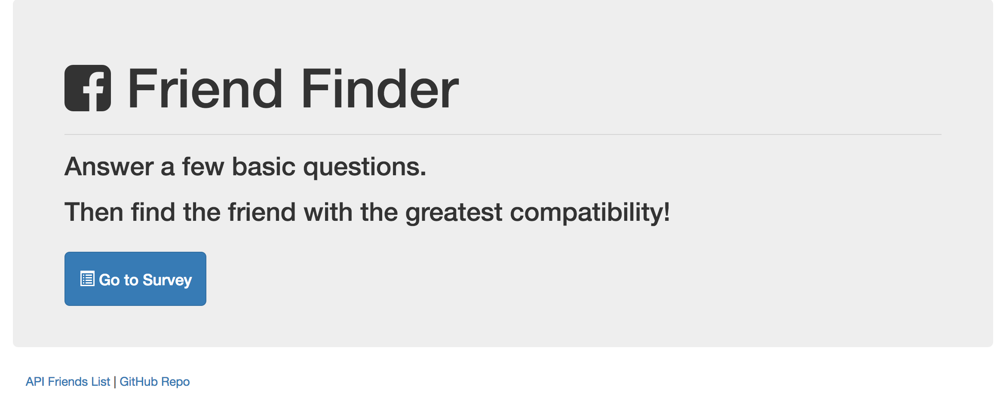

# Friend-Finder

* "FriendFinder" application -- basically a dating app. This full-stack site will take in results from users surveys, then compare their answers with those from other users. The app will then display the name and picture of the user with the best overall match.

To run this app in node you need to install express and body-parser npm packages.

* Check out the app at  https://friend-finder8.herokuapp.com/

